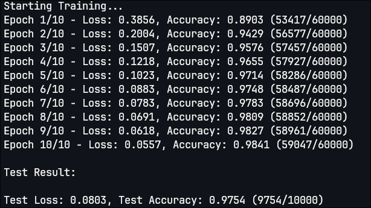

# MNIST Classification From Scratch In C++

# Usage
### Prerequisite
- cmake >= 3.15
```cpp
cmake -S . -B build/
cmake --build build/
./build/bin/app
```
# Result
- Generalization gap < 1%
<p align="center">
  
</p>
